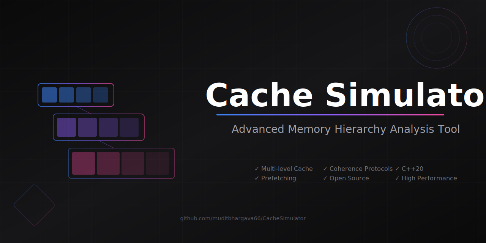

<div align="center">

# Cache Simulator


[](https://github.com/muditbhargava66/CacheSimulator/graphs/contributors)
[](https://github.com/muditbhargava66/CacheSimulator/commits/main)
[](https://github.com/muditbhargava66/CacheSimulator/issues)
[](https://github.com/muditbhargava66/CacheSimulator/stargazers)

**A state-of-the-art cache and memory hierarchy simulator featuring advanced prefetching, multi-processor support, power/area modeling, and comprehensive performance analysis tools.**



[**Documentation**](docs/) | [**Quick Start**](#quick-start) | [**Features**](#key-features) | [**Benchmarks**](#benchmarks) | [**Contributing**](#contributing)

</div>

## What's New in v1.4.3

- **Cache Associativity Bug Fix**: Hit ratio no longer decreases with increasing associativity
- **PLRU Correctness**: Fixed floating-point truncation in tree-walk depth; added power-of-2 guard
- **Victim Cache Fixes**: `getAllValidAddresses()` no longer drops address 0; `invalidateBlocksInRange()` no longer corrupts FIFO indices
- **Dead Code Removal**: Removed unused `lruOrder`/`fifoOrder`/`nextFifoIndex` from `CacheSet`
- **Namespace Cleanup**: `VictimBlock`/`VictimCache` now properly in `cachesim` namespace

## Key Features

### Cache Architecture
- **Flexible Configuration**: Customizable L1/L2/L3 cache hierarchies
- **Multiple Replacement Policies**: LRU, FIFO, Random, Pseudo-LRU, and NRU
- **Advanced Write Policies**: Write-back, write-through, and no-write-allocate
- **Victim Cache**: Configurable 4-16 entry fully-associative cache
- **Block Sizes**: 32B to 256B configurable

### Power and Area Modeling
- **Dynamic Energy**: Per-access read/write energy (pJ)
- **Leakage Power**: Temperature-scaled static power (mW)
- **Area Breakdown**: Data array, tag array, decoder, sense amp, routing
- **Technology Nodes**: 7nm to 45nm process support

### Prefetching and Prediction
- **Stream Buffer Prefetching**: Sequential access optimization
- **Stride Predictor**: Pattern-based prefetching with confidence tracking
- **Adaptive Prefetching**: Dynamic strategy selection based on workload
- **Configurable Aggressiveness**: Tunable prefetch distance and accuracy

### Multi-Processor Features
- **MESI/MSI/MOESI Protocol**: Full coherence protocol implementations
- **Directory-Based Coherence**: Scalable coherence tracking
- **Interconnect Models**: Bus, Crossbar, Mesh, Ring, and Torus topologies
- **Atomic Operations**: Support for synchronization primitives
- **False Sharing Detection**: Identifies and reports cache line conflicts

### Performance Analysis
- **Detailed Statistics**: Hit/miss rates, access patterns, coherence traffic
- **Real-time Visualization**: ASCII-based charts and graphs
- **Memory Profiling**: Working set analysis and reuse distance
- **Parallel Benchmarking**: Compare multiple configurations simultaneously
- **Trace Analysis Tools**: Pattern detection and optimization recommendations

## Quick Start

### Prerequisites
- C++20 compatible compiler (GCC 10+, Clang 10+, MSVC 2019+)
- CMake 3.14+ or GNU Make

### Installation

#### Linux / macOS
```bash
git clone https://github.com/muditbhargava66/CacheSimulator.git
cd CacheSimulator
mkdir build && cd build
cmake -DCMAKE_BUILD_TYPE=Release ..
cmake --build . -j$(nproc)
```

#### Windows (PowerShell)
```powershell
git clone https://github.com/muditbhargava66/CacheSimulator.git
cd CacheSimulator
.\build.ps1
```

> See [docs/WINDOWS.md](docs/WINDOWS.md) for detailed Windows instructions.

### Basic Usage

```bash
# Run with default configuration
./build/bin/cachesim traces/simple.txt

# Run with custom parameters
./build/bin/cachesim 64 32768 4 262144 8 1 4 traces/workload.txt
#                    BS  L1   A1  L2    A2 P  D
# BS=Block Size, L1=L1 Size, A1=L1 Assoc, L2=L2 Size, A2=L2 Assoc, P=Prefetch, D=Distance

# Run with visualization
./build/bin/cachesim --vis traces/workload.txt

# Enable power analysis
./build/bin/cachesim --power --tech-node 22 traces/workload.txt

# Enable victim cache
./build/bin/cachesim --victim-cache traces/workload.txt

# Parallel processing
./build/bin/cachesim -p 8 traces/large_workload.txt
```

### Advanced Configuration

Create a JSON configuration file:

```json
{
  "l1": {
    "size": 32768,
    "associativity": 4,
    "blockSize": 64,
    "replacementPolicy": "NRU",
    "writePolicy": "WriteBack",
    "prefetch": {
      "enabled": true,
      "distance": 4,
      "adaptive": true
    }
  },
  "l2": {
    "size": 262144,
    "associativity": 8,
    "blockSize": 64,
    "replacementPolicy": "LRU"
  },
  "victimCache": {
    "enabled": true,
    "size": 8
  },
  "power": {
    "enabled": true,
    "techNode": 45
  },
  "multiprocessor": {
    "numCores": 4,
    "coherence": "MESI",
    "interconnect": "Bus"
  }
}
```

Run with configuration:
```bash
./build/bin/cachesim -c config.json traces/workload.txt
```

## Benchmarks

### Performance Results

| Configuration           | L1 Hit Rate | L2 Hit Rate | L3 Hit Rate | Overall | Avg Latency |
| ----------------------- | ----------- | ----------- | ----------- | ------- | ----------- |
| Basic L1 (32KB)         | 85.2%       | -           | -           | 85.2%   | 12.5 cycles |
| L1+L2 (32KB+256KB)      | 85.2%       | 78.3%       | -           | 96.7%   | 4.8 cycles  |
| L1+L2+L3 (8MB)          | 85.2%       | 78.3%       | 92.1%       | 99.4%   | 2.1 cycles  |
| With Prefetching        | 89.1%       | 82.5%       | 94.2%       | 99.6%   | 1.8 cycles  |
| High-Performance Config | 91.3%       | 85.2%       | 95.8%       | 99.8%   | 1.5 cycles  |

### Feature Comparison

| Feature                 | Improvement               | Notes                    |
| ----------------------- | ------------------------- | ------------------------ |
| L3 Cache                | 15% fewer memory accesses | 8MB inclusive LLC        |
| MOESI Protocol          | 20% less bus traffic      | Owned state optimization |
| Ring/Torus Interconnect | Lower latency at scale    | 8+ core systems          |
| Victim Cache            | 25% fewer conflict misses | Direct-mapped L1         |
| NRU Policy              | 15% faster than LRU       | Large working sets       |
| Prefetching             | 40% miss reduction        | Sequential workloads     |

### Use Cases

| Application              | Recommended Config                    |
| ------------------------ | ------------------------------------- |
| CPU Design Education     | Basic L1+L2, LRU policy               |
| Performance Optimization | Full hierarchy, adaptive prefetching  |
| Side-Channel Research    | L3 cache, precise timing, profiler    |
| Multi-core Systems       | MOESI/MSI protocol, Ring interconnect |

## Tools and Utilities

### Cache Analyzer
```bash
./build/bin/cachesim --verbose traces/workload.txt
```

### Performance Comparison
```bash
# Compare multiple configurations
./build/bin/cachesim -c config1.json traces/workload.txt
./build/bin/cachesim -c config2.json traces/workload.txt
```

## Project Structure

```
CacheSimulator/
├── src/                         # Source code
│   ├── core/                    # Core simulation components
│   │   ├── multiprocessor/      # Multi-processor simulation
│   │   ├── cache.cpp/.h         # Cache implementation
│   │   ├── memory_hierarchy.cpp/.h
│   │   ├── victim_cache.h       # Victim cache
│   │   └── replacement_policy.h # Pluggable policies
│   ├── models/                  # Power and area models
│   │   ├── power_model.cpp/.h
│   │   ├── area_model.cpp/.h
│   │   └── power_constants.h
│   ├── utils/                   # Utility classes
│   │   ├── parallel_executor.h
│   │   ├── visualization.h
│   │   └── config_utils.cpp/.h
│   └── main.cpp                 # Main entry point
├── tests/                       # Test suite
│   ├── unit/                    # Unit tests
│   ├── integration/             # Integration tests
│   └── performance/             # Performance benchmarks
├── docs/                        # Documentation
│   ├── user/                    # User guides
│   ├── developer/               # Developer docs
│   └── features/                # Feature documentation
├── configs/                     # Configuration examples
└── traces/                      # Example trace files
```

## Testing

```bash
cd build
ctest --output-on-failure

# Run specific test categories
ctest -R unit
ctest -R integration
ctest -R performance
```

## Documentation

See [docs/README.md](docs/README.md) for complete documentation index:

- [Getting Started](docs/user/getting-started.md) - Installation and basic usage
- [User Guide](docs/user/user-guide.md) - Complete user manual
- [Configuration](docs/user/configuration.md) - Configuration options
- [CLI Reference](docs/user/cli-reference.md) - Command-line options
- [Architecture](docs/developer/architecture.md) - System design
- [API Reference](docs/developer/api-reference.md) - Code API

## Contributing

We welcome contributions! Please see our [Contributing Guide](contributing.md) for details.

### How to Contribute
1. Fork the repository
2. Create a feature branch (`git checkout -b feature/amazing-feature`)
3. Commit your changes (`git commit -m 'Add amazing feature'`)
4. Push to the branch (`git push origin feature/amazing-feature`)
5. Open a Pull Request

### Code Style
- Follow the existing C++20 style
- Use meaningful variable names
- Add comments for complex logic
- Include unit tests for new features

## Citation

If you use this simulator in your research, please cite:

```bibtex
@software{CacheSimulator2026,
  author = {Mudit Bhargava},
  title = {Cache Simulator: A C++20 Cache and Memory Hierarchy Simulator},
  version = {1.4.3},
  year = {2026},
  url = {https://github.com/muditbhargava66/CacheSimulator}
}
```

## Performance Tips

1. **For Large Traces**: Use parallel processing with `-p` flag
2. **For Conflict Misses**: Enable victim cache with `--victim-cache`
3. **For Write-Heavy Workloads**: Use write combining buffer
4. **For Multi-Core**: Choose appropriate interconnect topology
5. **For Best Performance**: Use release build with `-O3` optimization

## Educational Use

This simulator is ideal for:
- Computer Architecture courses
- Cache behavior studies
- Performance analysis research
- Learning about memory hierarchies
- Understanding cache coherence protocols

---

<div align="center">

**Star this repo if you find it useful!**

[](https://star-history.com/#muditbhargava66/CacheSimulator&Date)


📫 **Contact**: [@muditbhargava66](https://github.com/muditbhargava66)
🐛 **Report Issues**: [Issue Tracker](https://github.com/muditbhargava66/CacheSimulator/issues)

© 2026 Mudit Bhargava. [Apache License 2.0](LICENSE)
<!-- Copyright symbol using HTML entity for better compatibility -->

</div>
